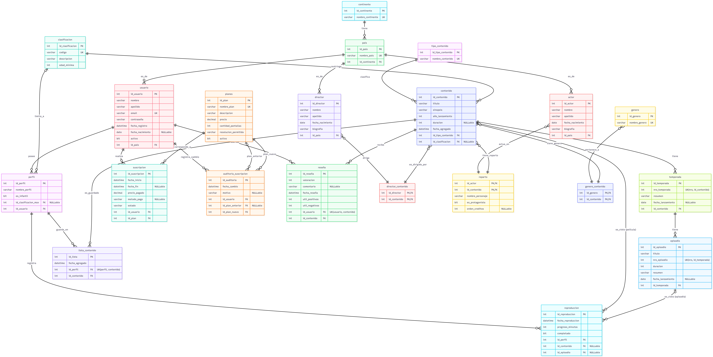

# Base de Datos para un servicio de Streaming - FilmStream

**Alumnos:**
  - Fernández, Néstor 
  - Montecino, Franco
  - Pérez, Bruno

**Profesores:**
  - Villegas, Darío
  - Cuzziol, Juan José
  - Vallejos, Walter
  - Badaracco, Numa

**Institución Educativa:** Universidad Nacional del Nordeste - Facultad de Ciencias Exactas y Naturales y Agrimensura 

**Carrera:** Licenciatura en Sistemas de Información 

**Año:** 2025

 

## Indice 

[Capítulo I: Introducción](#capítulo-i-introducción)

  - Tema
  - Planteamiento del Problema
  - Objetivos del Trabajo
      - Objetivos Generales
      - Objetivos Específicos
        
[Capítulo II: Marco Conceptual](#capítulo-ii-marco-conceptual)

[Capítulo III: Metodología Seguida](#capítulo-iii-metodología-seguida)

  - Descripción de cómo se realizó el Trabajo Práctico
  - Herramientas (Instrumentos y procedimientos)

[Capítulo IV: Desarrollo del Tema / Presentación de Resultados](#capítulo-iV-desarrollo-del-tema--presentación-de-resultados)

   - Modelo relacional
   - Diccionario de Datos - FilmStream
     
[Capítulo V: Conclusiones](#capítulo-v-conclusiones)

[Capítulo VI: Bibliografía](#capítulo-vi-bibliografía)

## Capítulo I: Introducción

El presente capítulo introduce el tema del proyecto de estudio, el cual consiste en el desarrollo de una base de datos funcional para un servicio de streaming "FilmStream".
A continuación, se detallarán el tema de estudio, el planteamiento del problema de investigación y los objetivos propuestos, tanto generales como específicos.

### Tema

El trabajo se enfoca en el diseño, modelado e implementación de una base de datos relacional para una plataforma de streaming "FilmStream". El propósito es gestionar de manera eficiente diversos contenidos audiovisuales (series, películas y documentales), incluyendo información detallada sobre su género, los actores y directores participantes, y sus valoraciones. Además, se busca gestionar la información referente a los usuarios del servicio, sus suscripciones y su historial de visualización.

### Planteamiento del Problema 

Actualmente, los servicios de streaming constituyen la principal forma de consumo de contenido audiovisual. Por ello, se requiere de una correcta organización y gestión de los datos que permita asegurar la implementación de una base de datos robusta y eficiente. El problema de investigación se centra en la siguiente pregunta:
¿Cómo estructuramos una base de datos que nos permita gestionar de manera ordenada el contenido de la plataforma y la manera en la que sus usuarios interactúan con esta?
A partir de esta pregunta principal, se desprenden los siguientes interrogantes específicos que guiarán el desarrollo del proyecto:
- ¿Qué entidades y relaciones se precisan para garantizar la representación del dominio del problema?
- ¿Cómo garantizamos la integridad referencial y evitamos la redundancia de datos (mediante la normalización)?
- ¿Cómo logramos mayor eficiencia en las consultas, asegurando un acceso a la información rápido y consistente?

### Objetivos del Trabajo

  ### Objetivos generales

  Diseñar y modelar una base de datos relacional normalizada, que permita gestionar de manera integral el catálogo de contenidos audiovisuales y las interacciones de los usuarios en una plataforma de streaming.

  ### Objetivos específicos 

  - Definir las entidades claves del sistema: contenido, actores, directores, valoraciones, usuarios, reseñas, y establecer sus respectivas relaciones.
  - Aplicar el correcto manejo de claves primarias, foráneas y distintas restricciones para asegurar la integridad de los datos.
  - Proponer mecanismos de seguridad básicos, como la encriptación de contraseñas y las restricciones de acceso.
  - Proveer una estructura flexible que permita la escalabilidad del sistema ante el crecimiento futuro del catálogo y la base de usuarios.

## Capítulo II: Marco Conceptual o Referencial

El desarrollo de una plataforma de streaming como FilmStream se enmarca dentro de un contexto de transformación digital impulsado por las Tecnologías de la Información y Comunicación (TICs). Estas innovaciones tecnológicas han reconfigurado radicalmente la industria del entretenimiento, permitiendo la distribución global inmediata de contenido audiovisual y facilitando nuevos modelos de negocio basados en suscripción y acceso bajo demanda.

La globalización, entendida como la intensificación de las relaciones sociales mundiales, se manifiesta en esta industria a través de la convergencia cultural, donde contenidos locales adquieren proyección internacional y las producciones transnacionales se normalizan. Las plataformas de streaming representan un fenómeno de "glocalización", combinando ofertas globales con adaptaciones a contextos regionales específicos.

En el ámbito económico, estas plataformas operan bajo lógicas digitales caracterizadas por externalidades de red, donde el valor del servicio aumenta con el número de usuarios, y economías de escala que reducen los costos marginales de distribución. El crecimiento se sustenta en modelos de suscripción recurrente y en la monetización de datos de comportamiento de los usuarios.

El desarrollo regional se ve impactado a través de la reconfiguración de las cadenas productivas del entretenimiento, donde surgen oportunidades para clusters creativos locales que se insertan en redes globales de valor. La producción se descentraliza geográficamente mientras la distribución se universaliza.

Finalmente, la sustentabilidad en este sector abarca dimensiones económicas (modelos de negocio viables), ambientales (optimización del consumo energético en centros de datos), culturales (preservación y democratización del acceso a producciones diversas) y sociales (acceso inclusivo a contenidos educativos y culturales).

Conceptos clave como "plataforma de streaming", "contenido audiovisual digital", "experiencia de usuario", "algoritmos de recomendación" y "arquitectura multitenancy" constituyen los pilares conceptuales que permiten comprender la complejidad técnica y operativa de sistemas como FilmStream, situando el proyecto dentro de un ecosistema digital en constante evolución donde la innovación tecnológica se articula con transformaciones culturales, económicas y sociales.

## Capítulo III: Metodología Seguida

Este proyecto se realizó siguiendo los siguientes pasos:

### Descripción de cómo se realizó el Trabajo Práctico

- **Elección del tema**: para elegir el tema a desarrollar, cada uno de los integrantes del grupo dió sus ideas. Luego de un intercambio de ideas se procedió a realizar una encuesta via Whatsapp, en donde se colocaron los temas que más satisfacieron al grupo, y el que más votos consiguió fue el ganador.
- **Creación del modelo conceptual y relacional**: una vez elegido el tema, se realizaron los modelos conceptual y relacional, en donde cada integrante realizaba los cambios que considerara oportuno hasta llegar al modelo definitivo.
- **División de temas**: se dividieron los temas 1 (Manejo de Transacciones y Transacciones Anidadas), 2 (Procedimientos y Funciones Almacenadas) y 3 (Optimizacion de Consultas a traves de Indices) entre los integrantes del grupo de manera al azar, y cada uno realizó su respectiva documentación y codificación.
- **Realización en conjunto del tema 4**: entre los integrantes se desarrolló en conjunto el tema 4 asignado (Indices Columnares en SQL Server).
- **Aplicación de todos los temas al script**: se procedió a aplicar todos los scrips hechos en separado al código principal y verificar su coherencia entre los hechos por los demás integrantes.

### Herramientas (Instrumentos y procedimientos)

- **ERD Plus**: es una herramienta de modelado en línea utilizada para crear diagramas entidad-relación (ERD) y esquemas relacionales de manera visual e intuitiva. También sirve para exportar el trabajo a un modelo físico.
- **SQL Server Management Studio (SSMS)**: es un entorno integrado para gestionar cualquier infraestructura de SQL Server, desde escribir y ejecutar consultas hasta administrar bases de datos y sus componentes.
- **Microsoft Learn**: Es una plataforma de aprendizaje gratuita de Microsoft que ofrece rutas de capacitación interactivas y documentación oficial para dominar sus tecnologías, como SQL Server y Azure. Muy útil para la investigación de los distintos temas.
- **MermaidChart**: Es una herramienta en línea que permite crear diagramas (de flujo, de secuencia y relacionales de bases de datos) simplemente escribiendo texto.

## Capítulo IV: Desarrollo del Tema / Presentación de Resultados 

### Modelo Relacional 

## Diccionario de Datos - FilmStream
Consulta el [diccionario de datos completo](./docs/diccionario/) para ver el detalle de todas las tablas.

Tablas principales:
contenido: Películas, series y documentales
usuario: Datos de usuarios registrados
suscripcion: Planes y fechas de suscripción
reproduccion: Historial de visualización
Ver más en el [diccionario completo](./docs/diccionario/)

### Manejo de Transacciones y Transacciones Anidadadas

En este tema, exploraremos cómo asegurar la integridad de los datos (ACID) al agrupar operaciones. Aprendemos a confirmar cambios con COMMIT, revertir errores con ROLLBACK y gestionar la complejidad de las transacciones anidadas. 

> Acceder a la siguiente carpeta para la descripción completa del tema [Manejo de Transacciones y Transacciones Anidadas](https://github.com/brunoezeq/ProyectoBD_Grupo11/tree/main/scripts/05_Manejo_Transacciones).

### Procedimientos y Funciones Almacenadas

En este tema, descubrimos cómo los procedimientos almacenados pueden automatizar tareas repetitivas, gestionar transacciones y mejorar el control de los datos, mientras que las funciones almacenadas facilitan cálculos y transformaciones en tiempo real.

> Acceder a la siguiente carpeta para la descripción completa del tema [Procedimientos y Funciones Almacenadas](https://github.com/brunoezeq/ProyectoBD_Grupo11/tree/main/scripts/04_Procedimientos_y_Funciones)

### Optimizacion de Consultas a traves de Indices

En este tema, aprenderemos cómo los índices pueden acelerar las búsquedas, reducir el tiempo de respuesta en operaciones de lectura y mejorar el rendimiento general del sistema. Exploramos los diferentes tipos de índices, cómo y cuándo aplicarlos, y una comparación real de qué tan eficientes son.

> Acceder a la siguiente carpeta para la descripción completa del tema [Optimizacion de Consultas a traves de Indices](https://github.com/brunoezeq/ProyectoBD_Grupo11/tree/main/scripts/06_Optimizacion_Consultas)

### Indices Columnares en SQL Server

En este tema, exploramos los índices columnares, una tecnología clave para analítica y Data Warehouse. Veremos cómo comprimen datos y aceleran consultas de agregación masivas, comparándolos con los índices tradicionales.

> Acceder a la siguiente carpeta para la descripción completa del tema [Indices Columnares en SQL Server](https://github.com/brunoezeq/ProyectoBD_Grupo11/tree/main/scripts/03_Indices_Columnares)
